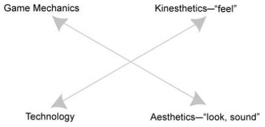
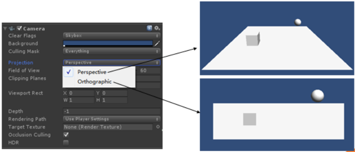

# 四、游戏对象与图形基础
{:.no_toc}

>   
> **_It was beautiful, historical, artistically subtle in a way that science can't capture, and I found it fascinating_**  
>   
> --- Steve Jobs, Stanford Report, June 14, 2005
>  

* 目录
{:toc}

_预计时间：2-3 * 45 min_

## 1、构建游戏世界

### 1.1 游戏原型设计

艺术就是利用语言、声音、文字、绘画、眼神、呼吸、肢体等表达形式，创造游戏场景或情境，使人通过感知（看、听、嗅、触）得到某种审美的满足。因此，尽早的呈现游戏世界并与它互动，是感知游戏世界的第一步。例如：作家唐三描述了《斗罗大陆》，设计师就需要不断用绘图、手办等去描绘与改进这个世界。一方面，满足作者的目标，即“成神之路就是对世界法则的认知，每个人的有自己独特的成神之路，必须靠自己的努力”；另一方面，满足玩家的审美，特别是要逐步挖掘玩家内心深处的梦想或清洁 -- “修仙成神”。所以 Adams 强调，游戏过程就是玩家实现梦想之路。

Tracy Fullerton 在《游戏设计工坊》用原型设计描述这个步骤

> 原型是优秀游戏设计的核心。原型开发是为您的想法创建一个工作模型，允许您测试其可行性并对其进行改进。虽然游戏原型是可玩的，但通常只包含对美术作品、声音和功能的粗略近似。它们非常像草图，其目的是让你专注于一小部分游戏机制或功能，并观察它们是如何运作的。
>
> 许多第一次设计游戏的设计师宁愿投身其中并立即开始创造“真正的”游戏，而不是从原型开始。但是如果你投入时间，你就会发现没有什么比一个好的原型制作过程更有价值去提高游戏玩法了。当您在制作原型时，您不需要考虑如何完善它的外观或技术是否优化。您所需要担心的只是基本机制，如果这些机制能够维持游戏测试人员的兴趣，那么您就知道您的设计是可靠的。

游戏原型设计将设计师从编程或技术细节中解脱出来，聚焦于 MDA ：MDA的含义是指机制（Mechanics）、动态（Dynamics）和美学（Aesthetics）

判断一下你成为游戏设计师的概率：

* 你有多少手办？大概多少投入？

 如果你对游戏世界设计感兴趣，请阅读游戏设计教材，Tracy Fullerton《游戏设计工坊》！

### 1.2 数字游戏原型设计

如果你有一支靠谱的设计与编程团队，他们不仅能用数字化手段支持游戏原型设计，而且能在短期内（3-7天）制作出游戏 Demo。甚至，编程团队可以创造出专用游戏设计引擎，支撑游戏的长期运行。

数据原型聚焦：

数字原型是可玩的，因此可以通过玩家测试，建立以数据为基础的分析与研究，持续改进游戏。

* 机制与动态：规则的复杂性、玩家成长曲线等基于数字的分析
* 运动：玩家的感觉分析
* 美学：玩家的试听分析
* 技术：渲染（shader）、VR、AI等

游戏设计工具：

* 平面设计工具，Photoshop...
* 3d 模型与动画设计工具，Maya...
* 游戏快速设计工具，Unity 3D, construct2...
* 专用游戏设计工具，...（游戏引擎都这么来的）

### 1.4 构建游戏 demo 的重要性

游戏开发是高风险（必须进入排名头部10~20%）、高投入（资源制作、市场开发与运维）的行业。

* 一个游戏故事，几幅游戏原画很难打动投资人
* 一个好题材，企业内部可能同时有几支团队并行开发 demo, 你必须成为最快最好的团队
* 你缺乏与题材合适的资源（形象设计、动画等）

Unity提供的资源和工具，可帮助你快速构建设想的游戏世界！

## 2、游戏常见对象构建与渲染

游戏世界构建在 Unity 中主要涉及两个菜单 GameObject 和 Assets。 当然最重要的还是 **Asset Store**！ 它不只是资源，更是我们学习构建游戏世界的素材。因为你未来可能在上面发布资源，成为贡献者或受益者。

### 2.1 基础游戏对象

**1、GameObject 菜单**

GameObject 菜单上游戏元素是最基础的。尽管实际游戏生产中我们更多依赖模型、预制，但它们都是由这些元素构成。只有理解它们才能更好的控制它们。

* Empty （不显示却是最常用对象之一）
    - 作为子对象的容器
    - 创建一个新的对象空间
* 3D 物体
    - 基础 3D 物体（Primitive Object）：立方体（Cube）、球体（Sphere）、胶囊体（Capsule）、圆柱体（Sylinder）、平面（Plane）、四边形（Quad）
    - 构造 3D 物体：由三角形网格构建的物体：
* Camera 摄像机，观察游戏世界的窗口
* Light 光线，游戏世界的光源
* Audio 声音
* UI 基于事件的 new UI 系统（专题介绍）
* Particle System 粒子系统与特效（专题介绍）

**2、基础物体**

Unity可以与用建模软件创建的任何形状的3D模型一起工作。但是在Unity中也有许多可以直接创建的原始对象类型，如立方体、球体、胶囊、圆柱体、平面和四边形。这些对象通常本身就很有用(例如，平面通常用作平面)，但是它们也提供了一种快速的方法来创建占位符和用于测试目的的原型。使用 GameObject -\> 3D Object菜单（或 API），可以将这些原始对象添加到场景中。

基础游戏物体使用，参见：[Primitive and placeholder objects](https://docs.unity3d.com/Manual/PrimitiveObjects.html)

以胶囊体（Capsule）为例：

它在场景视图中，是这样的多面体：

这个多面体非常有用，它通常作为人形物体的碰撞检测盒。特别在手机游戏中，并没有足够的计算资源进行复杂物体碰撞计算，而是用胶囊体取代。你常会发现你的手或臂膀能穿树而过，这不是因为你有特异功能，而是游戏技术就是这样！

**游戏物体共有的属性**

* Active
    - 不活跃则不会执行 update() 和 rendering 等消息或事件
* Name
    - 对象的名字，**不是ID**，不同对象可以重名。ID 使用 GetInstanceID()
* Tag
    - 字串，有特殊用途。如标识主摄像机等
* Layer
    - [0..31]，分组对象管理。常用于摄像机选择性渲染等
* transForm
    - 空间属性

### 2.2 Camera 摄像机 – 游戏场景渲染

相机是在场景空间中定义视图的对象。该对象的位置定义了观察点，而对象的正向(Z)和向上(Y)轴分别定义了视图方向和屏幕顶部。相机组件还定义了视图中区域的大小和形状。设置好这些参数后，相机就可以向屏幕显示它当前“看到”的内容。

摄像机对象使用，参见：[Cameras](https://docs.unity3d.com/Manual/CamerasOverview.html)

**1、摄像机与基本属性**

摄像机除了空间部件外，有一个 Camera 部件。甚至说，拥有 Cemara 部件的游戏对象都是摄像机！

 操作 04-01 ，摄像机 Cemara 基本属性练习：

* 新建一个场景，确保 Main Camera 位置（0，0，-10），欧拉角（0，0，0）
* 在场景中添加一些游戏元素
* 选择摄像机，观察场景视图中 Camera Preview
    - 选择移动工具 ，像机上显示红、绿、蓝三根轴
    - 选中 Z 轴（黄色），移动鼠标修改 Z 值
* 类似，选择旋转工具，修改旋转角 Z 值
* 修改 Camera 部件的投影（Project）属性，比较视图差别
    - 透视图（Perspective），修改位置 Z 的值
    - 正交视图（Orthographic），修改位置 Z 的值
* 修改 Camera 部件的视野角度（Field of View）

 要点

* 漫游是最简单的游戏软件，建好模型，控制好摄像机移动即可
    - 所谓第一人称游戏，就是摄像机作为玩家的眼睛
    - 所谓第三人称游戏，就是摄像机跟随玩家运动
* 透视图 vs 正交视图
    - 立体投影，越近物体越大
    - 平面投影，距离不影响视图

**2、Camera部件属性说明**

* Background: 背景颜色
* Culling Mask: 剔除遮罩。用于指定摄像机所作用的层(Layer)。
* Field of View(FOV): 视野范围。只针对透视镜头，用于控制视角宽度与纵向角度。
* Size: 视口大小。只针对正交镜头，设定为相当于屏幕高度的一半。
* ClippingPlanes: 表示摄像机的作用范围。只显示距离为[Near, Far]之间的物体。
* Viewport Rect: 控制摄像机呈现结果对应到屏幕上的位置以及大小。屏幕坐标系：左下角是(0, 0)，右上角是(1, 1)。
* Depth: 当多个摄像机同时存在时，这个参数决定了呈现的先后顺序，值越大越靠后呈现。

更多属性说明：[官方](https://docs.unity3d.com/Manual/class-Camera.html)， [中文](http://docs.manew.com/Manual/Cameras.html)

**3、多摄像机基础**

 操作 04-02，双摄像机“鸟瞰图练习”基础练习：

* 在场景中放置一些 3D 物体
* 放置第二摄像机
    - 设置正交视图；
    - 位置与旋转： positon(0,3,0), rotation(90,0,0)；
    - (x,y,w,h) = (0.9,0,0.1,0.12)
    - 0 （必须大于主摄像机深度）
* 运行结果：右下角出现了一个小窗口

 这种方法简单，但需要两倍的渲染时间。实战应该用 2D GUI 制作。例如：在 OnGUI 中先画地图，然后在制定位置画个红点。性能、性能、性能，重要的事情说三遍！

 多摄像机是制造效果的重要手段。游戏中同时显示多个场景镜头的实时渲染与合成，会产生特别的效果。这是一个中级话题。多摄像机合成的重要属性包括：

* Clear Flag：覆盖、叠加？
* Culling mask：选择渲染物体
* Depth：像机渲染的顺序

**课程实践：Unity中使用多个相机**

* 中文 [在Unity中使用多个相机 - 及其重要性](http://www.manew.com/thread-47076-1-1.html)
* 原文 [Using Multiple Unity Cameras – Why This May Be Important?](http://blog.theknightsofunity.com/using-multiple-unity-cameras-why-this-may-be-important/)

## 3、面向对象的游戏编程

## 作业与练习

**自学资源**

* 用户手册 
    - [图形元素](https://docs.unity3d.com/Manual/GraphicsOverview.html)
    - [声音元素](https://docs.unity3d.com/Manual/AudioOverview.html)

* c# 结构体

不负责的连接： http://www.cnblogs.com/kissdodog/archive/2013/05/11/3072832.html

* C# 枚举与常数

不负责任的连接： http://www.cnblogs.com/kissdodog/archive/2013/01/16/2863515.html

**作业内容**

1、操作与总结

* 参考  Fantasy Skybox FREE 构建自己的游戏场景
* 写一个简单的总结，总结游戏对象的使用

2、编程实践

* 牧师与魔鬼 动作分离版

**作业提交要求**

* 仅能用博客或在线文档提交作业，建议使用 Github 提交代码和作业。**不能使用docx、pdf等需要下载阅读的格式**
* deadline 下周二 24 点前

